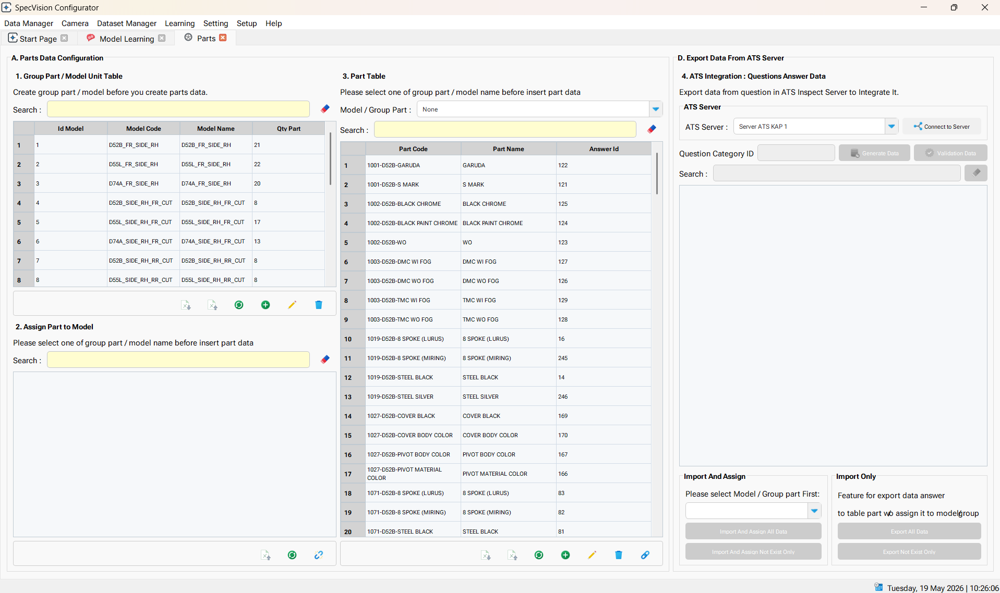
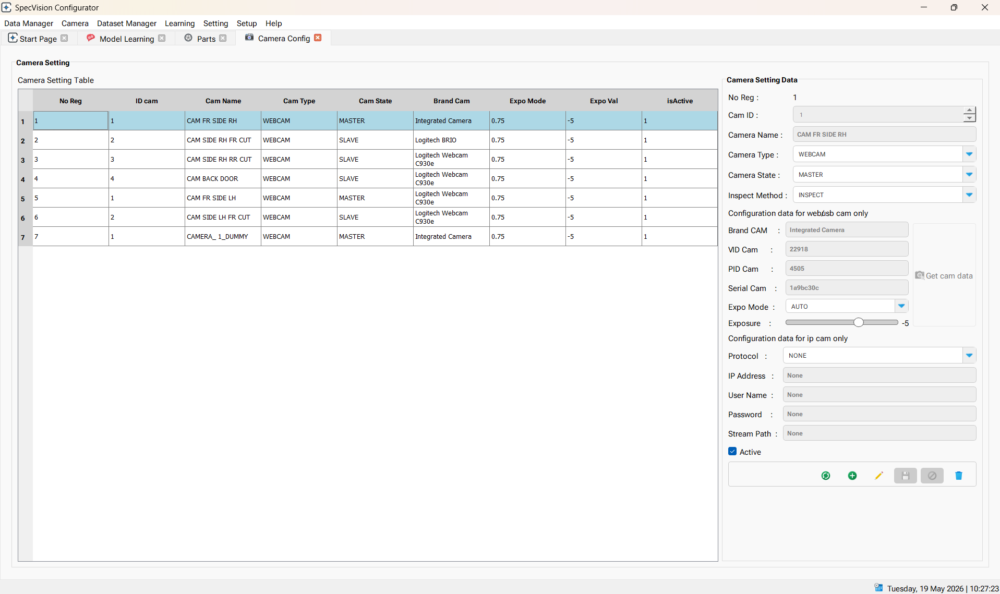
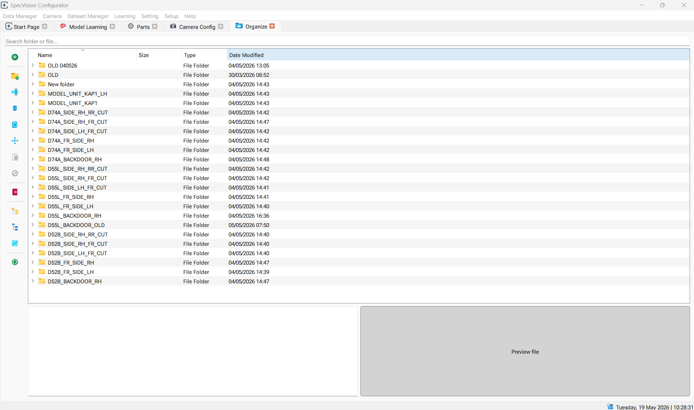
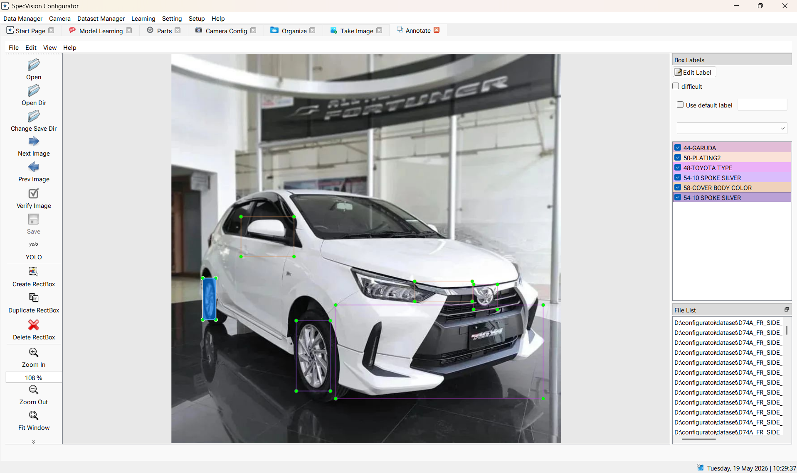
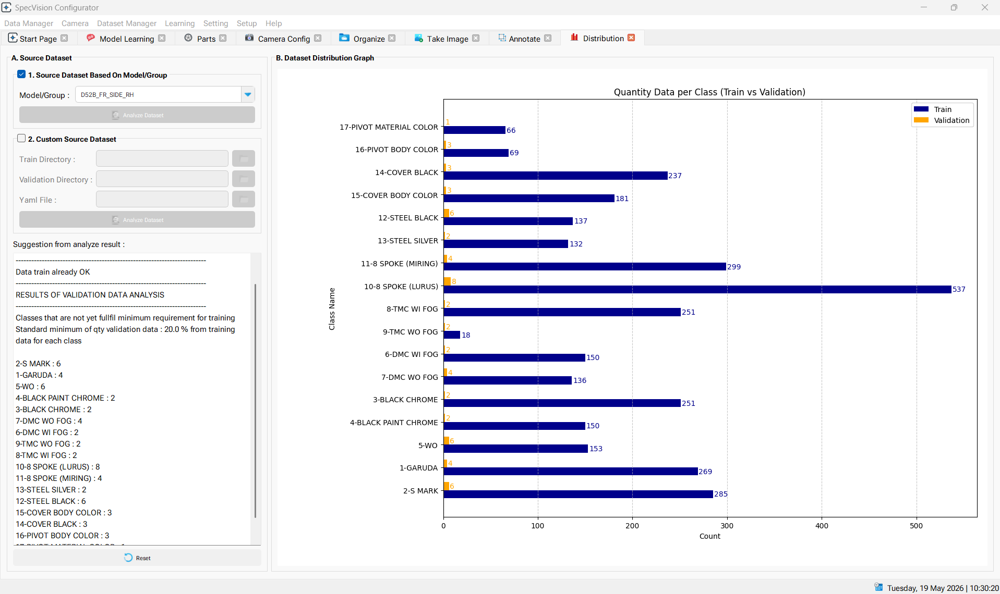
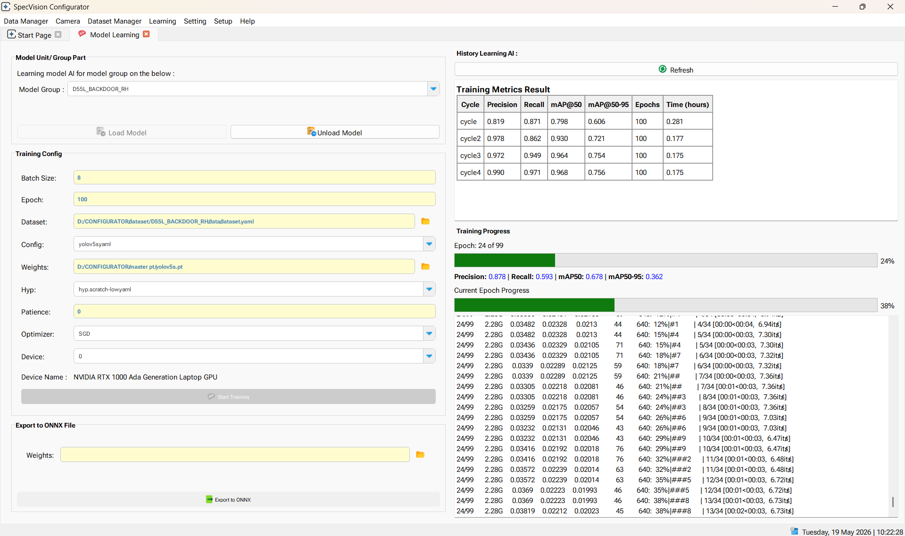
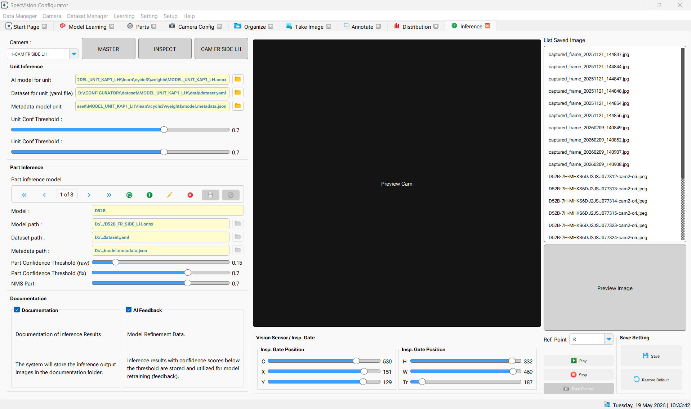

<div align="center">
  

  <h1>SpecVision Configurator</h1>
  
  <p>
    <strong>Application used to configure and manage parameters for the SpecVision Inspect</strong>
  </p>

  <p>
    <a href="https://www.python.org/downloads/"></a>
    <a href="https://riverbankcomputing.com/software/pyqt/"></a>
    <a href="https://opencv.org/"></a>
    <a href="https://ultralytics.com/"></a>
    <a href="https://onnxruntime.ai/"></a>
    <a href="https://www.sqlite.org/index.html"></a>
  </p>
</div>

---


## 📌 Overview

**SpecVision Configurator** is a desktop application used to configure and manage parameters for the SpecVision Inspect.
It provides an intuitive interface to set up camera inputs, ONNX models, detection parameters, model AI learning and system integrations.

---

## ✨ Features

* 🎥 Multi-camera configuration (up to 8 cameras, tested in 4 cameras)
* 🧠 ONNX model setup (unit & part detection)
* 🎯 Confidence & NMS threshold adjustment
* 🧩 Inference & Inspection gate configuration
* 📁 Dataset & model path management
* 🧠 Model Learning 
* 🧪 Model Testing and Evaluation
* 🔗 ATS system integration setup

## 🛠️ Installation Prerequisites

Make sure the following software is installed before running the application:

1. SOFTWARE PREREQUISITES
All software already present in SOFTWARE PREREQUISITIES folder
* Python (recommended version: 3.9+)
* Git-2.50.1-64-bit.exe
* Microsoft Visual C++ Redistributable (VC_redist.x64.exe)

---

## 📦 Installation

1. Install all software prerequisites
2. Copy Folder CONFIGURATOR to D:\
3. Open Command Prompt, navigate to D:\CONFIGURATOR
```bash
    cd D:\CONFIGURATOR
```
4. Create a virtual environment
```bash
    python -m venv virenv
```
5. Activate the virtual environment
6. Install depedencie from local folder (ext_library folder) - Note : All dependencies are compatible with Python 3.11.9
```bash
    pip install -r requirements.txt --no-index --find-links=./ext_library
```
Note : if there any bug when you open annotate menu please follow this steps :
For LabelImg Issue : 
1. Copy labelImg.py from SPECVISION CONFIGURATOR\BUGFIX\LabelImg\labelImg.py to D:\CONFIGURATOR\virenv\Lib\site-packages\labelImg

For Canvas.py Issue : 
1. Copy canvas.py from SPECVISION CONFIGURATOR\BUGFIX\libs\canvas.py to D:\CONFIGURATOR\virenv\Lib\site-packages\libs


## ▶️ Usage
1. Using Shortcut : configurator_app
2. Using Command Line :
```bash
python main_app.py
```


## ⚙️ Configuration Modules

## ⚙️ Data Manager

Manages all master data required for the inspection system.

- **Products** – Define product types to be inspected  
- **Parts** – List of components for each product  
- **Inspection Items** – Define inspection criteria  
- **Point Check** – Configure inspection points/areas  
- **ATS Questions** – Manage ATS checklist data  
- **ATS Integration** – Configure system integration  
- **Setup** – General system configuration  

### 🔹 Camera Settings

- Register and configure cameras


### 🔹 Inspection Settings

* Define inspection gate area
* Configure trigger mechanism

### 🗂️ Dataset Manager

- **Organize Dataset** – Manage and structure dataset files  

- **Capture Images** – Capture images from camera  
- **Annotate Data** – Label images for training  

- **Data Distribution** – Analyze dataset distribution



### 🧠 Learning

- **Model Training** – Train models using prepared datasets 
 
- **Model Testing** – Evaluate trained models for performance and accuracy  

### ⚙️ Settings

- **Inference** – Configure model parameters such as model path, confidence threshold, and NMS 
 
- **ATS Server** – Configure connection settings for ATS system integration  

### 🛠️ Setup

- **Create Configuration File** – Generate a configuration file for SpecVision Inspect system setup  


## 🧩 Project Structure

```
specvision-configurator/
│
├── Assets/          # Contains UI-related resources such as icons, images, and style
├── classify/        # Module for image classification tasks(YOLO).
├── controllers/     # Controller classes for handling user interactions
├── data/            # database (SQLite database) & result of take image
├── dataset/         # Dataset for training models
├── ext_librarys/    # External libraries / python depedencies
├── master pt/       # Pytorch trained model 
├── modal            # Modal classes for UI components
├── models/          # Model classes for image classification
├── resources/       # Resource files & Help
├── secure_key/      # Secure key for encryption
├── segment/         # YOLO files
├── utils/           # YOLO files Helper functions used across the project such as data processing, visualization, and general utilities.
├── views/           # Contains UI display components responsible for rendering the application interface
├── main_app.py      # Main window
└── requirements.txt

```

---

## 🐞 Issue Classification

Issues are categorized based on system domain:

* **Functional** – logic or processing errors
* **UI/UX** – interface and layout issues
* **Integration** – external system communication
* **Performance** – speed or resource issues
* **Data** – incorrect or missing data

---

## 🤝 Contributing

Contributions are welcome.
Please open an issue first to discuss major changes.

---

## 📄 License

This software is proprietary and intended for internal use only.
Unauthorized distribution or modification is not permitted.

---

## 👨‍💻 Author
Yudhi C Andres (2026)
Developed for AI-based inspection system configuration and monitoring.

=====================================================================

